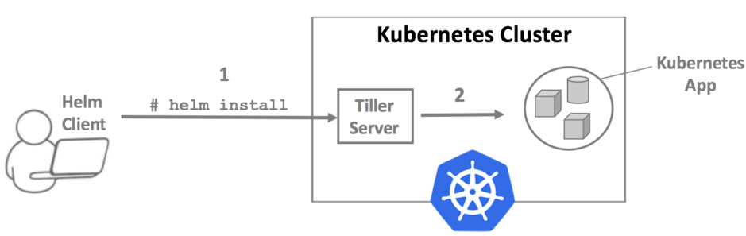

# **Helm** - Kubernetes Package Manager

Deploying Kubernetes application which involve creating multiple resources – such as pods, services, deployments, and replicasets which requires YAML manifest file. But this can be very complex.

[Helm](https://helm.sh) is the package manager for Kubernetes. Like any other package managers(yum, apt), Helm provide a standard way to deploy, configure, upgrade, and run an Kubernetes application in a matter of minutes.

Helm uses a packaging format called `charts`. A chart is a collection of files that describe a related set of Kubernetes resources.

You can check [this](https://github.com/C123R/kubernetes-hands-on/tree/master/helm-example/nginx) sample helm chart which can deploy nginx along with service and configmap.

## Installation

```sh
brew install kubernetes-helm
```

Others can follow instructions from [here](https://helm.sh/docs/using_helm/#install-helm).

## How it works

Helm Package Manager has two major components:

### `Helm Client` - command-line client for end users.

- Local chart development
- Interacting with the Tiller server
- Getting release details

### `Tiller` - incluster server that interacts with the Helm client

- Listening for incoming requests from the Helm client  
- Combining a chart and configuration to build a release
- Installing charts into Kubernetes, and then tracking the subsequent release
- Upgrading and uninstalling charts by interacting with Kubernetes



## Getting starting with HELM Chart Templating

Before creating Helm Charts, lets go through the Helm Chart directory structure.

```sh
mychart/
  Chart.yaml   # contains a description of the chart
  values.yaml  # This file contains the default values for a chart
  charts/      # contain other charts(subcharts)
  templates/   # template of K8s manifest files
  ...
```

Make sure you have running kubernetes cluster and HELM cli installed.

**Initialize helm cli:**

```sh
helm init --client-only
```

**List Helm default repositories:**

```sh
helm repo list
```

Lets follow offcial [helm documetaion](https://helm.sh/docs/chart_template_guide/#a-starter-chart) for creating first chart.

**Adding new repositories:**

```sh
helm repo add zeiss https://zeisshelmrepo.blob.core.windows.net/helm/

helm repo list
```

```sh
helm search zeiss
```

You can also search for public charts:
```sh
$ helm search redis

NAME                            	CHART VERSION	APP VERSION	DESCRIPTION
stable/prometheus-redis-exporter	3.0.0        	1.0.3      	Prometheus exporter for Redis metrics
stable/redis                    	9.0.1        	5.0.5      	Open source, advanced key-value store. It is often referr...
stable/redis-ha                 	3.6.2        	5.0.5      	Highly available Kubernetes implementation of Redis
stable/sensu                    	0.2.3        	0.28       	Sensu monitoring framework backed by the Redis transport
```

**Install kubernetes application using helm:**
```sh
## Dry run
helm install --namespace $(whoami) zeiss/k8s-handson -n $(whoami) --dry-run --debug

## Install
helm install --namespace $(whoami) zeiss/k8s-handson -n $(whoami)

## To list installed helm releases.
helm ls

## Get manifest created by our helm release
helm get manifest $(whoami)

## Delete helm release
helm delete $(whoami) # This will still keep the history

helm ls -a

## Delete release with history as well
helm delete --purge $(whoami)
```
